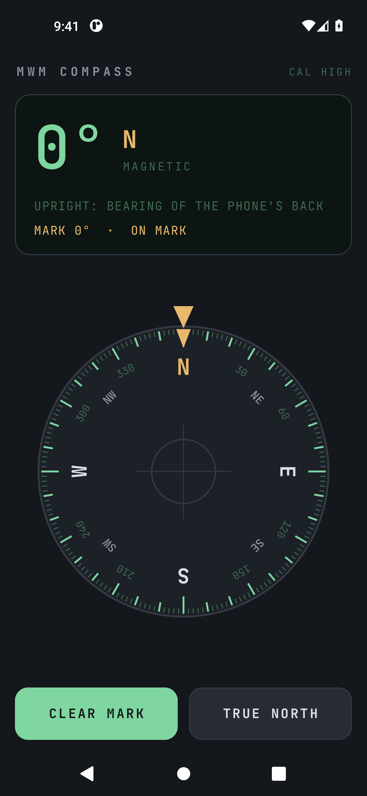

# MWM Compass

A plain, precise compass for Android, made for use outdoors. A big degree
readout, a compass card that turns under a fixed mark, and a bubble level.
That is the whole job.

- **No ads, no account, no tracking.** The app does not ask for the internet
  permission, so it has no way to phone anywhere.
- **Steady heading while you walk.** It uses Android's fused rotation sensor
  (magnetometer, accelerometer and gyroscope together) and smooths the last
  degree of jitter. Tilt is compensated, so the phone does not have to be held
  perfectly flat.
- **Magnetic or true north.** True north uses the World Magnetic Model built
  into Android. Your position is used on the phone only, to look up the local
  declination, and is kept so the correction still works offline.
- **Mark a bearing.** Tap MARK while facing a target; the display then tells
  you which way to turn, and by how many degrees, to walk back onto it.
- **Hold it flat or upright.** Held upright like a camera, the bearing is where
  the back of the phone points.
- **Calibration warning** when Android reports the magnetometer as unreliable,
  with the figure-8 fix.
- The screen stays on while the app is open.

## 📲 Download

**[⬇ Latest APK](https://github.com/Matswm86/mwm-compass/releases/download/latest/mwm-compass-cbae552.apk)**
&nbsp;·&nbsp; [all builds](https://github.com/Matswm86/mwm-compass/releases)

Open the link on your phone, tap the file, and allow "install from this source"
when Android asks. Android 8.0 or newer (minSdk 26). The filename carries the
commit id on purpose, so your browser can never serve you a cached old build. If
the link 404s, a newer build has landed: grab the newest `mwm-compass-*.apk` off
the releases page.

Debug-signed. Reinstalling over a build with a different signature means
uninstalling the old one first.

## Using it

| On screen | What it means |
|-----------|---------------|
| `274° W` | Your heading, and its 16-point compass name |
| MAGNETIC / TRUE | Which north the heading is measured from |
| CAL HIGH / MED / LOW / POOR | How much Android trusts the magnetometer right now |
| Amber triangle at the top | The fixed lubber mark: the direction the top of the phone points |
| Amber triangle on the card | Your marked bearing |
| Dot in the middle | Bubble level; it turns bright when the phone is within about 2° of level |

**Accuracy.** A phone compass is only as good as its magnetometer. Keep it away
from magnets, speakers, car dashboards, steel railings and phone cases with
magnetic clasps. If CAL drops to LOW or POOR, wave the phone in a slow figure 8 a few
times. For navigation where a wrong bearing is dangerous, carry a real
baseplate compass as well.

## What it deliberately does not do

- No maps, GPS track, coordinates or altimeter.
- No network access of any kind.
- No themes or settings screens.

## Building

There is no local build step. GitHub Actions builds the APK on every push to
`main`, runs the unit tests, then installs the APK on an emulator, checks that
a live heading reaches the display and sets a mark. The README screenshot comes
from that emulator run.

Kotlin and Jetpack Compose, no third-party libraries beyond AndroidX and
kotlinx.coroutines. The display font is JetBrains Mono (SIL Open Font License, see `licenses/`).

## License

MIT, see [LICENSE](LICENSE).
